  

###

<table width="100%" border="0" cellspacing="0" cellpadding="0">
  <tr>
    <td valign="top" width="65%">
      <h1 align="left">🐧 ~/ENG-Omar-Wael $ cat intro.md</h1>
      

        • <b>User:</b> Omar Wael  
        • <b>Type:</b> Full Stack Developer using Python  
        • <b>Status:</b> Crafting clean backend logic and building scalable web apps.  
        • <b>Toolbox:</b> Python, Django, Flask, FastAPI, JavaScript, React, jQuery, Bootstrap, HTML, CSS, PostgreSQL, MySQL, Linux, Bash, Git, Docker, Kubernetes.
      

    </td>
    <td valign="middle" width="35%" align="right">
      
    </td>
  </tr>
</table>

###

  
  
  
  
  
  
  
  
  
  
  
  
  
  
  
  
  
  
  
  
  
  
  
  
  
  
  
  
  
  
  
  
  
  
  
  
  

###

  
  
  

###

 

  <table border="0" cellpadding="6" cellspacing="6" align="center" style="width: 100%; max-width: 900px;">
    <tr>
      <td align="center" width="25%"></td>
      <td align="center" width="25%"></td>
      <td align="center" width="25%"></td>
      <td align="center" width="25%"></td>
    </tr>
    <tr>
      <td align="center" width="25%"></td>
      <td align="center" width="25%"></td>
      <td align="center" width="25%"></td>
      <td align="center" width="25%"></td>
    </tr>
  </table>

 

###

  

